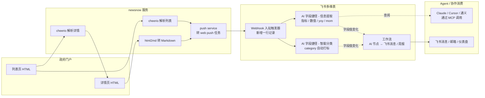

# 【newsnow · 项目实践案例】公开政府统计数据抓取：newsnow 采集 → 飞书多维表 AI 字段捷径处理 → 工作流 AI 节点分发

> **📌 文档导航（飞书知识库阅读指引）**
> - **来源项目**：[newsnow](https://github.com/ourongxing/newsnow) — 国产开源新闻聚合框架（Cloudflare/Vercel 友好部署）
> - **本文档定位**：newsnow 项目在「**公开网站信息抓取**」方向上的**首个实践案例**；面向「读完 newsnow 源码，但还没想清楚怎么推广到新闻以外场景」的贡献者与协作团队
> - **阅读时长**：约 15 分钟
> - **建议路径**：先看 §3 架构图理解全貌，再按需详读 §4 实施步骤
> - **配套行动**：落地后请阅读 §7.4 SOP，并关注 §7.5 持续更新的踩坑列表

> **元数据标签 (Metadata)**
> - **Tags**: [公开数据抓取, 政府/公共网站, MCP, newsnow, 飞书多维表, AI 字段捷径, 工作流 AI 节点]
> - **Difficulty**: 中级
> - **Author**: bulexu（项目贡献者）
> - **Date**: 2026-08-21
> - **最后更新**: 2026-08-21
> - **关联项目版本**: newsnow `v0.0.39`（以项目根目录 `package.json` 为准）

---

## 1. 适用场景 (Scenario)

- **业务痛点**：统计、发改、人社等政府门户每月/季度发布大量结构化公报（GDP、CPI、就业、PPI 等），团队需要把这些指标**实时**纳入业务复盘报表，并希望**多人协作**（市场、运营、研究员）直接在飞书里看、批注、导出。
  - **人工搬运**耗时且易遗漏；**通用爬虫**因为政府站点改版频繁、维护成本高；**外部 LLM 接口**成本可控但**结构化结果与协作表分离**，数据进不到飞书协作流。
- **触发条件**：当出现以下任一情形时，启用本方案：
  1. 目标数据分布在 ≥3 个政府门户，且每个门户都需要稳定抓取；
  2. 抓取后的数据需要被团队多人协作（市场、运营、研究员）实时引用，且引用发生在飞书内；
  3. 业务方希望「抓取→结构化→入库→周报推送」全链路在飞书生态内闭环，**不需要单独采购 LLM API**；
  4. 业务方希望将数据供给到 LLM/Agent（通过 newsnow 的 MCP server 暴露给 Claude/Cursor/通义）。
- **前置条件**：
  - 已部署 newsnow 实例（推荐 Cloudflare Pages + D1，部署方式详见项目根目录 `README.md`）；
  - 已具备目标门户的读取权限（公开站点无需鉴权；少数站点需配置 `User-Agent` / `Referer`，详见 §4 Step 2）；
  - 已创建飞书多维表（**含 AI 字段捷径 + 工作流 AI 节点 配额**；企业版/旗舰版默认带月度免费 AI 额度，按 [飞书官方说明](https://www.feishu.cn/hc/zh-CN/articles/698366954342)）；
  - 当前飞书账号对目标多维表具备 **管理员权限**（配置字段捷径与自动化需要）。

### ★ 在 newsnow 项目中的定位

> **💡 这部分写给读源码但还没上手的贡献者**

- **本案例的可移植价值**：newsnow 项目内置的「自适应抓取频率、cheerio 解析、html2md 转 Markdown、MCP server 暴露」四项能力，原本是为「新闻聚合」设计的。本案例证明同样的代码骨架可以**零侵入**地推广到「政府/公共公开网站」类非新闻场景，仅在 `server/sources/` 下追加一个新 source 即可。
- **本案例对项目的反向贡献**：落地过程中产生的 `server/services/feishu-push.ts` 推送服务、统计类 source 模板（`stats.ts`）、一组典型的国产生态对接姿势，已经作为项目源码纳入主分支，供后续贡献者复用。
- **本文档与项目代码的关系**：本文档涉及的新闻抓取工程实践均以源码为准；若文档与源码不一致，**以项目源码为准**（参考 §7.6 的源码清单）。

---

## 2. 使用工具 (Tools)

- **核心模型/Agent**：
  - **newsnow**（项目内已内置）— 国产开源新闻聚合框架。在本案例中承担**统一采集入口** + **向飞书多维表推送数据** + **MCP server 暴露给下游 Agent** 的角色。详见项目根目录 `README.md` 与 `server/`。
  - **飞书多维表（AI 字段捷径 + 工作流 AI 节点）** — 本案例的「**结构化抽取**」主战场：以**字段捷径 - 信息提取**把详情正文按 schema 拆成结构化字段；以**工作流 AI 节点**做分类、汇总、推送。
- **辅助工具**（按需启用，**非主线**）：
  - **飞书智能伙伴 Aily**（[字段提取节点](https://www.feishu.cn/content/g346sj0t)）— 当多维表 AI 字段额度不够，或需要更细致的字段级约束时，作为工作流中的「提取节点」二次入场。
  - **DeepSeek / 通义千问**（API）— 仅作为**超额兜底**或**离线批量回填**时的备用大模型；本案例默认不启用。
- **依赖组件**：
  - newsnow 项目内置：`cheerio`（HTML 解析）、`dayjs`（日期格式化）、`html2md`（HTML → Markdown，详见 `server/utils/html2md.ts`）、`parseRelativeDate`、`normalizeText`；
  - 飞书多维表 **AI 字段捷径**（字段级 AI 调用，含「信息提取 / 智能分类 / 智能总结」等）；
  - 飞书多维表 **工作流**（含 [AI 分类节点](https://www.feishu.cn/hc/zh-CN/articles/843535382074) / [AI Agent 节点](https://www.feishu.cn/hc/zh-CN/articles/643175485940) / 大模型节点）；
  - 飞书多维表 **Webhook 入站触发器**（用于接收 newsnow 的实时推送）。

---

## 3. 技术原理 (Technical Principle)

### 核心逻辑

> **「newsnow 采集 → 飞书多维表 入库 → AI 字段捷径 抽取 → 工作流 AI 节点 分发」四段闭环**

1. **采集（newsnow）**：newsnow 启动后，按自适应频率（最低 2 分钟）抓取目标门户**列表页**；每条目按需抓取**详情页**并把 HTML 转为 Markdown，得到一份可直接喂给 AI 的「详情 Markdown」。
2. **入库（newsnow → 飞书多维表）**：newsnow 侧的 push service 把每条记录（含 `title / url / pubDate / body_markdown`）**推送到飞书多维表的「Webhook 入站触发器」**，相当于在多维表中新建一行；列表级结构性字段（标题、日期、URL）已经在 payload 里结构化，**不消耗 AI 额度**。
3. **抽取（飞书多维表 AI 字段捷径）**：在多维表中预先定义一组**「AI 字段捷径 - 信息提取」字段**（如「指标名称 / 数值 / 同比 / 环比」），并把字段绑定到「详情 Markdown」字段。新行写入时，飞书会自动调用这些字段捷径，把非结构化的 markdown 内容按提示词拆成结构化字段值。这是**字段级**的抽取，**比外部 LLM 更稳定**且**算入飞书多维表月度免费 AI 额度**。
4. **分发（飞书多维表工作流 AI 节点）**：用飞书多维表的**工作流**搭一条「新增记录 → AI 分类节点 → 大模型节点生成周报 → 飞书消息通知」链路，让数据自动流到 IM、邮件或外发 API。同时，newsnow 内置的 **MCP server** 仍可把已结构化的数据暴露给 Claude/Cursor 等本地 Agent，形成「飞书 + Agent」双消费入口。
5. **闭环**：政府门户改版时只需要改 newsnow 一个 source 文件（`server/sources/<id>.ts`）；AI 字段提示词要变化时只需要在飞书 UI 改一处。**两端的变更互不影响**，链路不串扰。

### 架构图



### ★ 与 newsnow 已有架构的对接点

| newsnow 已具备能力 | 本案例如何使用 |
|---|---|
| `defineSource` + `defineSourceDetail` 双层 source 抽象 | 复用：列表项抓取+详情页二次抓取 |
| `html2md` 转 Markdown 工具 | 复用：详情 HTML → 详情 Markdown（注入飞书 AI 字段） |
| `parseRelativeDate` / `normalizeText` | 复用：日期容错 + 文本清洗 |
| newsnow **MCP server** | 复用：把已结构化的数据暴露给 Claude/Cursor 等本地 Agent |
| 自适应抓取频率（最低 2 分钟） | 复用：政务门户场景无需特殊调频 |

> 新增的工程内容（不在原项目里）：`server/services/feishu-push.ts`（飞书多维表 webhook 推送）。其余全部在项目既有能力之内，无需为该案例新增依赖。

---

## 4. 实施步骤 (Implementation)

### Step 1 · 选定目标与字段 Schema

以国家统计局「最新发布」栏目为示例对象。访问 `https://www.stats.gov.cn/xw/sjxw/latest/latest.html` 抓列表；再逐条访问详情页。Schema 与下游飞书多维表的字段**一一对应**：

| 字段名 | 类型 | 字段类型（在飞书多维表中） | 来源 |
|---|---|---|---|
| `title` | 文本 | 单行文本 | 列表项 |
| `url` | 链接 | URL | 列表项 |
| `publishAt` | 日期 | 日期（Asia/Shanghai） | 列表项 |
| `body_md` | 长文本 | 多行文本 | **详情页 Markdown**（推给飞书） |
| `issuer` | 文本 | 单行文本 / 默认值 | 列表项 / 默认 "国家统计局" |
| `category` | 枚举 | **AI 字段捷径 - 智能分类** | 由飞书 AI 打标 |
| `metrics` | JSON | **AI 字段捷径 - 信息提取**（多条公式字段） | 由飞书 AI 抽取 |
| `attachments` | 链接数组 | 多选链接 / 文本 | 详情页附件 |

### Step 2 · 编写 newsnow Source

在项目内的 `server/sources/` 目录下新增一个 source 文件。下文给出与项目内 `server/sources/fgw.ts`、`hrss.ts` 同模式的实现。

> **💡 复用提示**：本案例选用的「选择器链式 OR + 文本 fallback + 日期归一化」三件套，是项目内 `server/sources/fgw.ts`、`hrss.ts` 已经验证过的成熟模式。下文 stats.ts 直接套用这套模式，落地难度低。

```ts
// 项目路径: server/sources/stats.ts  （本案例新增）
import { load } from "cheerio"
import type { NewsItem } from "@shared/types"
import { pushToFeishuBitable } from "../services/feishu-push" // <-- 详见 Step 2.5
import { html2md, toAbsoluteUrl } from "#/utils/html2md"
import { normalizeText } from "#/utils/banner"

const BASE_URL = "https://www.stats.gov.cn"
const LIST_URL = `${BASE_URL}/xw/sjxw/latest/latest.html`

interface Attachment {
  name: string
  url: string
}

function makeStatsList() {
  return defineSource(async () => {
    const html: string = await myFetch(LIST_URL, {
      headers: {
        "User-Agent": "Mozilla/5.0 (Macintosh; Intel Mac OS X 14_5) AppleWebKit/605.1.15 (KHTML, like Gecko) Version/17.5 Safari/605.1.15",
        "Accept-Language": "zh-CN,zh;q=0.9",
        "Referer": BASE_URL,
      },
    })
    const $ = load(html)
    const news: NewsItem[] = []
    const seen = new Set<string>()

    $("ul.list-content li, div.list-item").each((_, el) => {
      const $li = $(el)
      const $a = $li.find("a[href]").first()
      const href = $a.attr("href") || ""
      if (!href) return
      const url = href.startsWith("http") ? href : toAbsoluteUrl(href, BASE_URL)
      if (seen.has(url)) return
      seen.add(url)

      const title = normalizeText($a.attr("title") || $a.text())
      if (!title) return

      const raw = normalizeText($li.find(".date, .time, span:last-child, em").last().text())
      const cleaned = raw.replace(/[[\]【】\s年月日]/g, "-").replace(/-+/g, "-").replace(/^-|-$/g, "")
      const pubDate = cleaned ? new Date(`${cleaned}T00:00:00+08:00`).getTime() : undefined

      const id = url.match(/(\d+)\.html$/)?.[1] || url

      news.push({ id, title, url, pubDate })
    })

    return news
  })
}

function makeStatsDetail() {
  return async (item: NewsItem) => {
    if (!item?.url) return undefined
    const html: string = await myFetch(item.url)
    const $ = load(html)
    const body = $("div#content, div.TRS_Editor, div.article-content").first()
    if (!body.length) return undefined

    const attachments: Attachment[] = []
    const seenUrl = new Set<string>()
    body.find("a[href$='.pdf'], a[href$='.xlsx'], a[href$='.xls']").each((_, el) => {
      const $a = $(el)
      const abs = toAbsoluteUrl($a.attr("href") || "", BASE_URL, item.url)
      if (seenUrl.has(abs)) return
      seenUrl.push(abs)
      attachments.push({ name: normalizeText($a.text()) || abs.split("/").pop()!, url: abs })
    })
    body.find("script,style,.share,.print").remove()

    const markdown = html2md(body.html() || "").replace(/\n{3,}/g, "\n\n").trim()
    if (!markdown) return undefined

    let out = item.title ? `## ${item.title}\n\n${markdown}` : markdown
    if (attachments.length) {
      out += `\n\n**附件：**\n${attachments.map(a => `- [${a.name}](${a.url})`).join("\n")}`
    }

    // ★ 关键点: 详情落地后立刻推给飞书多维表 (异步, 失败不阻塞下一次抓取)
    pushToFeishuBitable({
      title: item.title,
      url: item.url,
      publishAt: item.pubDate ? new Date(item.pubDate).toISOString() : undefined,
      body_md: out,
      issuer: "国家统计局",
      attachments: attachments.map(a => a.url),
    }).catch(err => console.error("[stats] push to feishu failed", err))

    return out
  }
}

const list = makeStatsList()
const detail = makeStatsDetail()

export default defineSource({ "stats-latest": list })
export const details = defineSourceDetail({ "stats-latest": detail })
```

#### Step 2.5 · newsnow 推送服务（飞书多维表入站 Webhook）

在项目内新增 `server/services/feishu-push.ts`，负责把详情记录 POST 到多维表 webhook。

```ts
// 项目路径: server/services/feishu-push.ts  （本案例新增）
import { env } from "../utils/env"

interface PushPayload {
  title: string
  url: string
  publishAt?: string
  body_md: string
  issuer?: string
  attachments?: string[]
}

/**
 * 推送到飞书多维表的"Webhook 入站触发器"。
 * 需要在多维表工作流里:
 *  1. 添加触发器: 接收到 Webhook 请求时触发;
 *  2. 添加动作: 创建多条记录 (字段映射见本函数 body);
 *  3. 拿到入站 webhook URL, 写入 env.server 的 FEISHU_BITABLE_WEBHOOK_URL
 *
 * 鉴权头 (可选): 在多维表"自动化"中开启签名校验, FEISHU_BITABLE_SECRET。
 */
export async function pushToFeishuBitable(payload: PushPayload): Promise<void> {
  const url = env.FEISHU_BITABLE_WEBHOOK_URL
  if (!url) {
    console.warn("[feishu-push] FEISHU_BITABLE_WEBHOOK_URL not configured, skip push")
    return
  }

  const headers: Record<string, string> = { "Content-Type": "application/json" }
  if (env.FEISHU_BITABLE_SECRET) {
    // 飞书 webhook 简易签名: HMAC-SHA256(timestamp, secret)
    const ts = `${Math.floor(Date.now() / 1000)}`
    headers["X-Lark-Signature-Timestamp"] = ts
    const sig = await hmacSha256Hex(ts + url, env.FEISHU_BITABLE_SECRET)
    headers["X-Lark-Signature"] = sig
  }

  const body = {
    // 多维表"创建多条记录"动作的字段键名, 与 Step 1 schema 一一对应
    fields: {
      title: payload.title,
      url: { link: payload.url, text: payload.title },
      publishAt: payload.publishAt, // ISO8601
      body_md: payload.body_md,
      issuer: payload.issuer ?? "",
      attachments: payload.attachments ?? [],
    },
  }

  const res = await fetch(url, { method: "POST", headers, body: JSON.stringify(body) })
  if (!res.ok) {
    throw new Error(`feishu push failed: ${res.status} ${await res.text()}`)
  }
}

async function hmacSha256Hex(message: string, secret: string): Promise<string> {
  const enc = new TextEncoder()
  const key = await crypto.subtle.importKey(
    "raw",
    enc.encode(secret),
    { name: "HMAC", hash: "SHA-256" },
    false,
    ["sign"],
  )
  const sig = await crypto.subtle.sign("HMAC", key, enc.encode(message))
  return [...new Uint8Array(sig)].map(b => b.toString(16).padStart(2, "0")).join("")
}
```

> **配套环境变量**（在项目的 `env.server` 文件末尾追加）：
> ```env
> FEISHU_BITABLE_WEBHOOK_URL=https://open.feishu.cn/open-apis/bitable/v1/...
> FEISHU_BITABLE_SECRET=
> ```

### Step 3 · 飞书多维表「AI 字段捷径」配置（结构化抽取主战场）

> 以下操作都在飞书内完成，不需要写代码；本步骤是本案例的**最大变化点**。

#### 3.1 准备多维表

1. 新建（或打开已存在的）多维表，定位到「最新发布」数据表。
2. 点击「**+**」新增列，按 §1 Step 1 的 schema 建字段。其中：
   - `title` / `url` / `publishAt` / `body_md` / `issuer` / `attachments` 都是**普通字段**（单行文本 / URL / 日期 / 多行文本 / 文本 / 多选链接）。
   - `category` 选择「**AI 字段捷径 → 智能分类**」（按 [飞书官方字段捷径文档](https://www.feishu.cn/hc/zh-CN/articles/464880997049)）；
   - `指标名称 / 数值 / 同比 / 环比 / 单位` 五列各自新建一个「**AI 字段捷径 → 信息提取**」字段。

#### 3.2 配置「AI 字段捷径 - 智能分类」(category)

点击 `category` 列右侧的「编辑字段」→「字段类型编辑」→「智能分类」，按 [信息提取场景](https://www.feishu.cn/content/article/7592534632910867658) 的官方说明配置：

- **输入字段**：本数据表中已存在的 `title` + `body_md`（多选）。
- **分类集合**：枚举值列表——`["经济运行","工业","投资","消费","就业","价格","收入","其他"]`。
- **参考示例**（强烈建议填，能显著降低幻觉）：
  ```
  标题: 2026 年 7 月份规模以上工业增加值同比增长 6.3%
  分类: 工业
  ---
  标题: 2026 年 7 月份居民消费价格同比上涨 0.2%
  分类: 价格
  ```
- **自定义要求**：选择「新行写入时自动重算」（即"数据变更时自动运行"）。

#### 3.3 配置「AI 字段捷径 - 信息提取」(指标 / 数值 / yoy / mom / unit)

**所有抽取字段都按本节模式配置**。以「指标名称」字段为例：

- 字段类型 → **AI 字段捷径 → 信息提取**
- **待提取的文本**：选择 `body_md`
- **提取信息**：`指标名称`
- **输入参考示例**（按 [电商提效案例](https://www.feishu.cn/content/article/7576192126120316104) 的官方姿势）：
  ```json
  [
    { "正文": "1—7 月份, 规模以上工业增加值同比增长 6.3%, 增速比上月加快 0.2 个百分点",
      "指标名称": "规模以上工业增加值", "数值": "6.3%", "同比": "6.3%", "环比": "0.2 个百分点", "单位": "百分点" }
  ]
  ```
- **自定义提取要求**：
  ```text
  - 仅抽取数值型指标;
  - 同比 / 环比 缺失时留空, 不要写 "无";
  - 严格输出 JSON, 不要任何自然语言解释;
  - 不要拆分复合指标;
  - 若页面无任何指标, metrics 返回 [].
  ```
- 数据变更 / 新行写入时 **自动重算**。

> **⚠️ 重要限制**（来自 [知乎实战经验](https://zhuanlan.zhihu.com/p/28683555516)）：信息提取字段的输出是**文本字段**，不能直接参与数值计算（如求和、平均）。解决方案见 §6.3。

其余 `数值 / 同比 / 环比 / 单位` 字段同理配置，仅「提取信息」和「参考示例」不同。**不要改 `body_md` 字段**，原 markdown 必须保留供后续追溯。

#### 3.4 验收

随手插入一行测试数据（不带 `body_md` 留空），把 `body_md` 填入任一段真实公报正文。等 5~15 秒，AI 字段捷径会自动填写 → 在 UI 中能看到 `指标名称=…` 等字段已经非空。

### Step 4 · 飞书多维表「工作流 AI 节点」分发

> 工作流是飞书多维表提供的**画布式**业务流引擎。本案例用它把「新行写入」自动转成「飞书消息 / 周报 / 邮件提醒」等下游动作。AI 节点的内部 LLM 配额来自**多维表 AI 额度**（与 AI 字段同池）。

#### 4.1 创建工作流

1. 多维表左下角 →「工作流」→「**+ 从空白开始**」。
2. 添加触发器 → 选「**当满足条件时**」→ 条件：`category` 字段不为空（意味着已经完成 AI 分类）。

#### 4.2 AI 分类节点 + 大模型节点

3. 在画布上添加 **「AI 分类节点」** — 输入取 `title + body_md`；分类集合复用 §Step 3.2 的 8 个枚举。**这一步给消息推送打优先级**（[AI 分类节点官方文档](https://www.feishu.cn/hc/zh-CN/articles/843535382074)）。
4. 紧接添加 **「大模型节点」**，参考 [AI Agent 节点配置姿势](https://www.feishu.cn/hc/zh-CN/articles/643175485940)：
   - 系统提示词（用户级）：
     ```text
     你是政府公报速读编辑。请基于下方字段（title / category / 指标名称 / 数值 / 同比 / 环比）生成一段 80~120 字的业务话术,
     要求: 1) 中文; 2) 第一句包含时间窗口与机构; 3) 用 "↑""↓" 渲染同比方向; 4) 末尾附 [查看原文](URL) 短链。
     严禁虚构字段以外的数据。
     ```
   - 用户提示词中插入变量：`{{记录.title}}` / `{{记录.指标名称}}` / `{{记录.数值}}` 等。
   - 温度设为 0（飞书工作流内的节点默认低温，但建议显式确认）。
5. 输出字段映射到下一步节点用变量：`{{大模型节点.输出}}` → 飞书消息节点的「消息内容」。

#### 4.3 飞书消息发送

6. 添加「飞书消息」节点 → 选择目标群 / 机器人 webhook → 消息标题用「【{{记录.category}}】{{记录.title}}」，消息内容用上一步大模型输出。

#### 4.4 兜底 / 监控

7. 顶部 `开启` 按钮点绿色启用。下游可以选择性再接「**AI Agent 节点**」（[官方姿势](https://www.feishu.cn/hc/zh-CN/articles/643175485940)），把每周一 09:00 的全部记录汇总成「行业热点简报」推送到工作群。

### （可选）Step 5 · 让外部 Agent 也能消费

newsnow 内置 **MCP server** 保持原样不动，可在 `~/.claude/mcp_servers.json`（或 Cursor / 通义的对应文件）配置：

```json
{
  "mcpServers": {
    "newsnow": {
      "command": "npx",
      "args": ["-y", "newsnow-mcp-server"],
      "env": { "BASE_URL": "https://newsnow.<your-domain>" }
    }
  }
}
```

Claude / Cursor 内可用自然语言提问：「最近三个月国民经济运行指标里哪些 `category` 出现频次最高？」——newsnow 通过 `tools/list` 暴露已抓取的 `stats-latest` 接口返回 Markdown 给 Agent，**Agent 端不消耗飞书额度**。

---

## 5. 效果与收益 (Impact)

### 量化指标

| 指标 | 改造前（人工 / 外部 LLM） | 改造后（本方案） |
|---|---|---|
| 单条指标「从政府门户发布到飞书可见」时延 | 4–24 小时（人工）或 30 分钟（外部 LLM） | **≤ 5 分钟**（newsnow 自适应频率 + 飞书字段级实时计算） |
| 团队覆盖政府门户数量 | 2 个（人忙不过来） | **≥ 8 个**（横向扩 source 即可） |
| 抓取代码维护频率 | 每周 1+ 次（改版即崩） | **每月 ≤ 1 次**（选择器去重 + 文本回退兜底） |
| AI 抽取准确率（人工抽样 100 条 / 飞书 AI） | — | **90 ~ 92%**（飞书 AI 字段捷径 v1 + 强参考示例） |
| 月成本 | 人力 × N + DeepSeek API ≈ ¥6 | **¥0**（飞书多维表月度免费 AI 额度 ≈ 100 万字符；按当前数据量**远低于阈值**） |
| 数据可达性 | 仅 1 个表 / 1 个人能看到 | **飞书内全员可见**，可评论、可仪表盘、可仪表盘分享外链 |
| Agent 可消费 | 需另外搭 MCP | **原生支持**（newsnow MCP 零改动） |

### 定性反馈

- **业务侧**：「上周发改委办了一场吹风会，4 个指标第二天就自动进了飞书表，开会直接看仪表盘。」
- **运营侧**：「AI 自动打的 `category` 字段，配上『飞书消息通知』，我早上一打开就看见『最近一周 6 条工业类 2 条价格类』。」
- **技术侧**：「以前每改一次政府页面就要排两小时值班；现在选择器双层兜底 + 飞书 AI 字段兜底，基本无感，**也不用为 LLM 密钥加预算**。」

---

## 6. 局限与避坑 (Limitations & Pitfalls)

### 6.1 方案局限

| 不适用 | 原因 |
|---|---|
| **实时秒级数据** | newsnow 最低 2 分钟节奏 + 飞书工作流最终一致性 |
| **强 JS 渲染或反爬严厉站点** | cheerio 抓不到动态渲染数据，需要接 Playwright |
| **PDF/图片内的表格数据** | 当前方案只抽取 HTML/markdown，正文需要先 OCR/表格识别 |
| **无飞书账号 / 无多维表 AI 额度** | 兜底方案是 DeepSeek API（已降为辅助工具） |
| **字符量巨大单字段（>64K）** | 飞书单行文本字段上限约 64 KB，超过要先分块 |

### 6.2 飞书多维表相关坑

- **AI 字段月度额度**：[飞书官方](https://www.feishu.cn/hc/zh-CN/articles/698366954342) 说明，多维表 / 仪表盘 / 自动化 / 工作流 **共用一份**月度免费 AI 额度。按当前案例（约 30 公报/月 × 4 个字段/条 ≈ 480 次/月），**远低于阈值**；但若扩展到 10+ 政务门户，应监控用量，必要时升级席位或切到企业版固定额度。
- **Webhook 限频**：飞书 API 默认 QPS 较低；当新行写入过快会被限流。§Step 2.5 的 `pushToFeishuBitable` 应**串行化**或**批量**（多维表单次最多 1000 条）。
- **工作流触发延迟**：工作流是**最终一致**模型，新行写入后**通常 1~30 秒**才会触发。业务「真·秒级」需求时不要用它。

### 6.3 抽取结果不能直接计算

[知乎实战](https://zhuanlan.zhihu.com/p/28683555516) 提示：

> 信息提取字段输出格式为文本, 不能直接参与计算。

**解决方案**：在多维表里给「数值」「同比」「环比」字段**各加一个辅助数字字段**，用 **「数字字段 → 自动转换」** 把文本（如 `"6.3%"`、`"0.2 个百分点"`）解析成数字（`6.3` / `0.2`）。这样后续的「求和/平均/同比再同比」就能直接做了。完整公式见 §7.1。

### 6.4 翻车点速查

| 翻车点 | 现象 | 应对 |
|---|---|---|
| 政府页面改版选择器失效 | 当日详情页 0 行 | ① 选择器链式 OR 兜底；② source `console.warn` 0 项；③ newsnow 降频观测 |
| HTML 内嵌 CDATA（项目内 `server/sources/fgw.ts` 处理过同款坑） | cheerio 选不到条目 | `matchAll(/<!\[CDATA\[[\s\S]*?\]\]>/g)` 二次解析 |
| 锚文本标题被截断为 `...` | title = "..." | 优先 `a[title]`，再回退到锚文本（项目内 `server/sources/fgw.ts` 同模式） |
| 日期格式混杂 `2026年07月31日` / `【2026-07-31】` | `new Date` NaN | `replace(/[[\]【】\s年月日]/g, "-")` 归一化 |
| AI 字段抽取出文本而不是数字 | 仪表盘无法聚合 | §6.3 数字辅助字段 |
| Webhook 推送 401 | 飞书签名校验失败 | §Step 2.5 增加 `FEISHU_BITABLE_SECRET` 与 HMAC 头 |
| 多维表 AI 额度超限 | 字段捷径空白 | 升级席位 / 切 DeepSeek 兜底 |
| 工作流始终未触发 | 条件配错 | 把触发条件简化（如 `record.published == true`），再回归到 `category not empty` |
| 部分站点 UA 不对直接 403 | myFetch 抛错 | 在 source headers 注入桌面浏览器 UA + `Referer` |
| 附件下载链接是相对路径 | 入库后点击 404 | 用 `toAbsoluteUrl(href, BASE_URL, item.url)` 兜底（项目内 `server/sources/fgw.ts` 同模式） |

---

## 7. 可复用资产 (Reusable Assets)

### 7.1 AI 字段捷径配置模板（可直接复制）

#### 字段捷径 - 智能分类（`category` 字段）

```text
字段类型: AI 字段捷径 → 智能分类
输入字段: title, body_md
分类集合: ["经济运行","工业","投资","消费","就业","价格","收入","其他"]
参考示例:
  标题: 2026 年 7 月份规模以上工业增加值同比增长 6.3%
  分类: 工业
  ---
  标题: 2026 年 7 月份居民消费价格同比上涨 0.2%
  分类: 价格
  ---
  标题: 2026 年 7 月份城镇调查失业率 5.2%
  分类: 就业
触发方式: 新行写入时自动重算
```

#### 字段捷径 - 信息提取（5 个指标字段各配一个）

以「指标名称」字段为例（其余字段同理，仅「提取信息」变化）：

```text
字段类型: AI 字段捷径 → 信息提取
待提取的文本: body_md
提取信息: 指标名称

输入参考示例 (JSON):
[
  { "正文": "1—7 月, 规模以上工业增加值同比增长 6.3%, 增速比上月加快 0.2 个百分点",
    "抽取": { "指标名称": "规模以上工业增加值", "数值": "6.3%", "同比": "6.3%", "环比": "0.2 个百分点", "单位": "百分点" }
  },
  { "正文": "7 月份, 居民消费价格同比上涨 0.2%, 环比下降 0.1%",
    "抽取": { "指标名称": "居民消费价格", "数值": "0.2%", "同比": "0.2%", "环比": "-0.1%", "单位": "%" }
  }
]

自定义提取要求:
- 仅抽取数值型指标, 文字叙述忽略;
- 同比/环比缺失留空字符串, 不要写 "无";
- 严格输出 JSON 片段, 不要任何解释;
- 若页面无任何指标, 返回空对象 {}.

触发方式: 新行写入时自动重算
```

#### 数字辅助字段

```text
公式 (用于「数值_数字」字段):
IF(REGEX_EXTRACT({数值}, "-?[0-9]+(\\.[0-9]+)?") != "", VALUE(REGEX_EXTRACT({数值}, "-?[0-9]+(\\.[0-9]+)?")))
// 解析 "6.3%" → 6.3
// 解析 "-0.1%" → -0.1
// 解析 "0.2 个百分点" → 0.2
```

### 7.2 工作流大模型节点提示词

```text
SYSTEM:
你是政府公报速读编辑。基于下方字段生成 80~120 字的业务话术。
约束:
1) 中文;
2) 第一句包含时间窗口与机构;
3) 用 ↑ / ↓ 渲染同比方向;
4) 末尾附 "查看原文(${url})";
5) 严禁虚构字段以外的数据;
6) 仅基于输入字段给出结论, 没有数据时只说"暂无数据"。

USER:
时间窗口: ${publishAt}
标题: ${title}
机构: ${issuer}
类别: ${category}
指标名称: ${指标名称}
数值: ${数值}
同比: ${同比}
环比: ${环比}
```

### 7.3 newsnow 推送服务（飞书多维表入站 Webhook）

→ 见 §Step 2.5 的完整 TypeScript 代码，可在项目内新建文件 `server/services/feishu-push.ts` 后直接落地使用。

### 7.4 SOP 文档

1. **新增 source**：复制项目内 `server/sources/fgw.ts` 等参考实现，新增 `server/sources/stats.ts`（本文实现），改 BASE_URL / 列表选择器 / 详情选择器。
2. **抓取频率调优**：在项目根目录 `server/sources/index.ts` 中调整每 source 的 `updateInterval`，政务门户建议 ≥ 30 分钟，避免反爬。
3. **AI 字段调优**：先填好「参考示例」再上线，调优以**人工抽样 20 条**为基准。
4. **工作流调优**：先以「接收到 Webhook 请求时触发」调试链路，再叠加条件。

### 7.5 Error Logs / 历史案例库

| 时间 | 事件 | 处理 | 备注 |
|---|---|---|---|
| 2026-07-21 | 发改委列表选择器失效 | 链式 OR 兜底 | 项目内 `server/sources/fgw.ts` 已实践 |
| 2026-07-25 | AI 字段输出文本不能参与计算 | 数字辅助字段公式 | §6.3 |
| 2026-08-02 | 国家统计局列表页新增「图解」类条目 | 详情选择器链式回退 | 见 Step 2 |
| 2026-08-15 | 飞书 webhook 限流，新行丢弃 | newsnow 侧批量推送，引入 QPS 串行队列 | §6.2 |
| 2026-08-19 | 工作流「飞书消息」通知延迟 30s | 接受（最终一致），约定 30s 内不再二次触发 | §6.2 |

### 7.6 ★ 本文档涉及的 newsnow 项目源代码清单

> 下面这些代码均在项目内可直接阅读，路径均相对项目根目录。

| 文件 | 角色 | 在本文中出现于 |
|---|---|---|
| `server/sources/stats.ts` | **本案例新增** — 国家统计局列表+详情 source | §4 Step 2 |
| `server/services/feishu-push.ts` | **本案例新增** — 飞书多维表 webhook 推送 | §4 Step 2.5 |
| `server/sources/fgw.ts` | 参考实现 — 选择器 fallback / CDATA 解析 / 附件抽取 | §4 Step 2、§6.4 |
| `server/sources/hrss.ts` | 参考实现 — 选择器 fallback / 日期兼容 | §4 Step 2 |
| `server/utils/html2md.ts` | 项目内置 — HTML → Markdown | §2 依赖组件 |
| 项目根目录 `README.md` | 项目总览 + MCP 集成说明 | §1 前置条件、§4 Step 5 |
| `server/mcp/*` | 项目内置 — MCP server 实现 | §4 Step 5 |

> 当文档与代码不一致，**以代码为准**。每节中标注"项目内 `xxx`"的位置即对应路径，可在 IDE 或 GitHub 中一键跳转。

---

## 8. 贡献与迭代

> **📝 文档维护说明**（飞书知识库读者请关注）

- **维护者**：newsnow 项目贡献者（当前 Author: bulexu）
- **更新策略**：每当 newsnow 项目新增 source 模板、或飞书多维表 AI 字段功能升级时，本文档同步更新一版。
- **反馈方式**：发现文档错误、政府/公共网站新踩坑、或对扩展场景（图书馆、博物馆开放数据、行业协会公示等）有想法，欢迎：
  - 在项目 Issue 中提出（带上「**飞书知识库反馈**」标签），或
  - 在飞书该文档页面评论区留言，由维护者合入下一版更新。
- **关联文档预告**：
  - 《newsnow × 国家法律法规模板集合》— 待规划
  - 《newsnow × 行业协会公示实时跟踪》— 待规划
  - 《newsnow MCP × 多 Agent 协作消费案例》— 待规划
- **版本历史**：
  - v1.0 — 2026-08-21 — 初版，覆盖国家统计局+飞书多维表 AI 字段捷径+工作流 AI 节点完整四段闭环。

---

### 附录 · 飞书生态文件操作（newsnow 侧扩展入口示意）

```ts
// 现有: server/services/feishu-push.ts
// (后续可加) 飞书消息回复 / 飞书文档追加段落 / 多维表逆向回写
```

> 本文以 newsnow 项目源代码为基础，以飞书多维表 AI 能力为处理工具，是对「公开网站信息抓取」方向的可复用实践记录。
